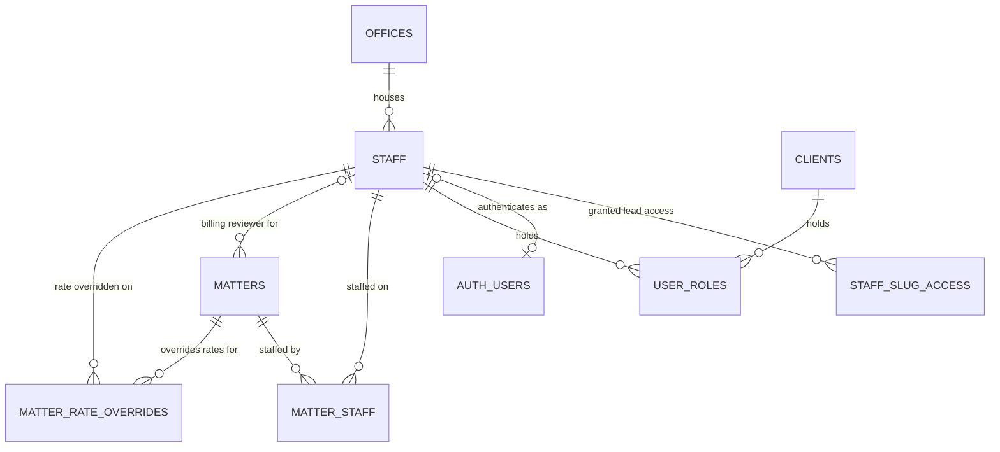
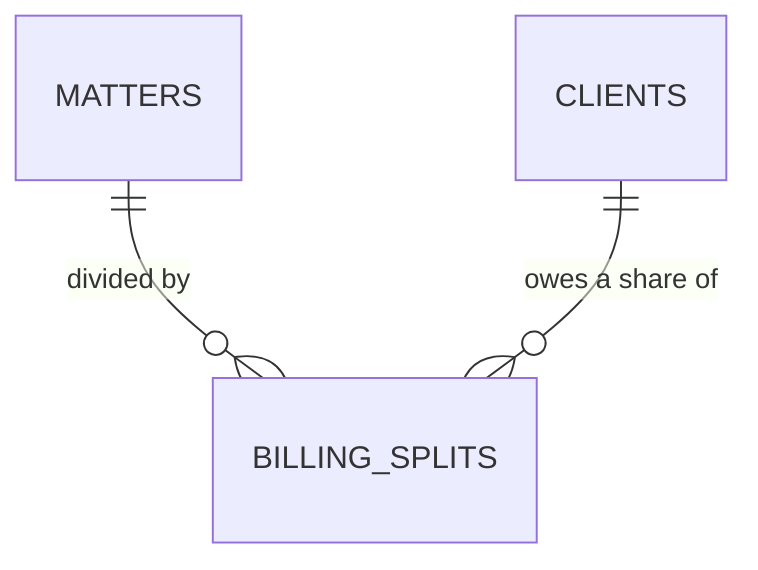
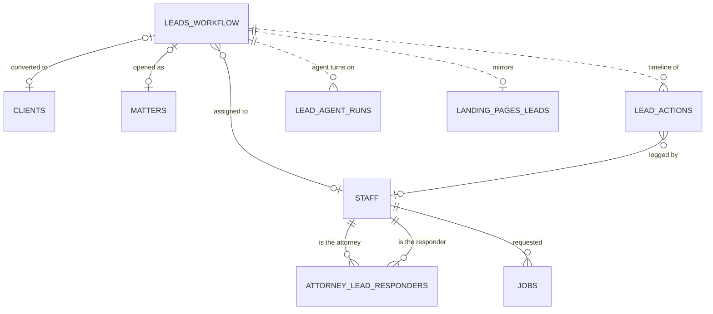
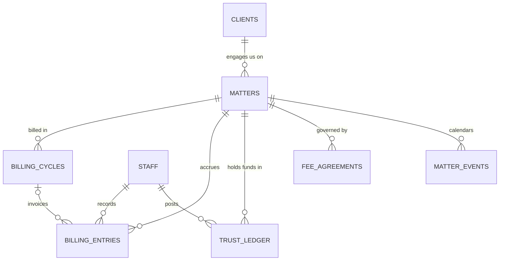
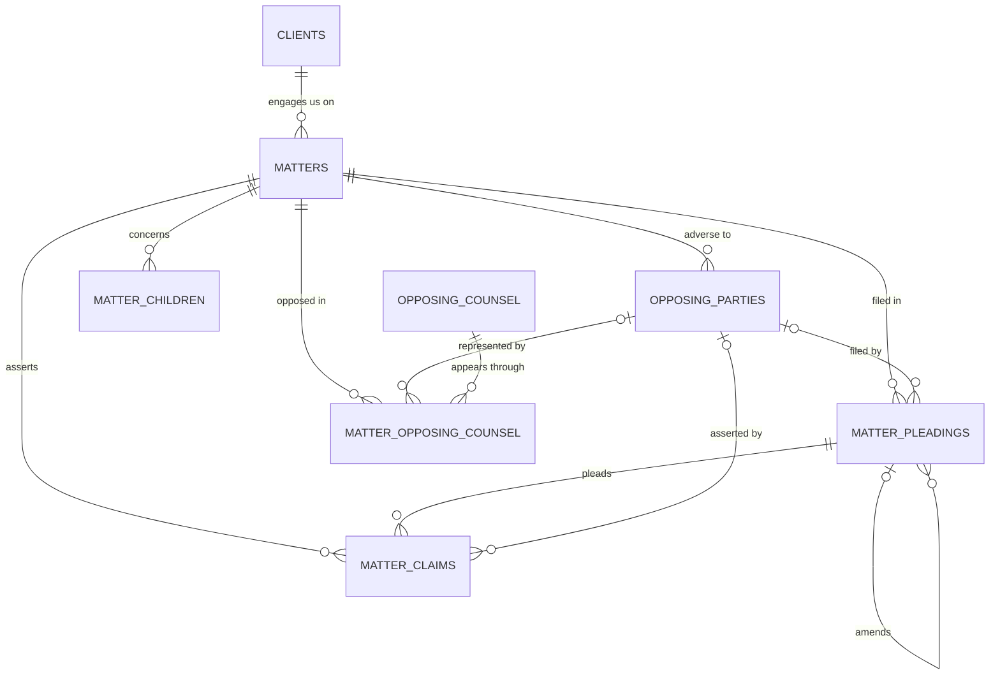
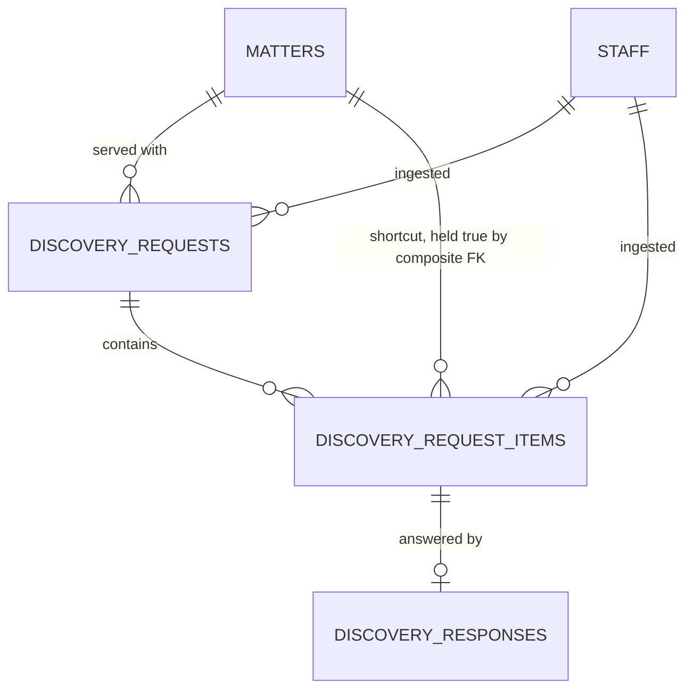

# Cyclone — Entity Relationship Diagrams

Six subject-area diagrams. Split deliberately: one ERD covering every table is
unreadable, and crossings grow much faster than node count. `MATTERS` and
`STAFF` repeat across frames so each frame can stay small.

Vetted line by line against the deployed schema after migration 022. Every
cardinality below traces to a column's nullability and its foreign key — if you
change a column between `NULL` and `NOT NULL`, the diagram needs updating too.

## Notation

| Marker | Meaning |
| ------ | ------- |
| `\|o` | zero or one |
| `\|\|` | exactly one |
| `}o` | zero or more |
| `}\|` | one or more |
| `--` | enforced by a foreign key |
| `..` | reference with **no** foreign key (cross-database join) |

Two rules that account for nearly every error worth catching:

1. **A nullable foreign key is `|o` / `o|` on the parent side, never `||`.**
2. **Markers are sided.** Zero-or-one is `|o` on the left of the line and `o|`
   on the right. `STAFF o|--o{ JOBS` puts a right-hand marker in a left-hand
   slot and renders wrong.

Labels read as a sentence from the left entity outward — *OFFICES houses
STAFF*. Mixed direction is what makes an ERD hard to read aloud.

---

## 1. People and access

- `staff.supabase_uid` is nullable — a staff row exists before that person ever
  logs in — so `AUTH_USERS` is `|o--o|`. It lives in the `auth` schema, outside
  the one we control; named without a dot because a dot breaks the parser.
- One person holds several roles as separate `user_roles` rows. **Clients hold
  roles too**, which migration 021 unblocked.
- `matters.billing_review_staff_id` is nullable: zero or one reviewer per
  matter, many matters per reviewer.

## 2. Split billing

`billing_splits` divides the **bill** between multiple clients on one matter.
Attorney revenue split is `matter_staff.split_pct` where `role = 'originating'`
— a different table. Both foreign keys here are `NOT NULL`, so this is a plain
junction, not a many-to-many on both sides.

## 3. Leads and the agent

- Lead rows themselves live in the **landing-pages** project; this database
  holds `leads_workflow`, joined in Python. `LANDING_PAGES_LEADS` is drawn on a
  dashed edge to mark the boundary.
- Every `foreign_session_uuid` edge is dashed: there is no foreign key behind
  it, so nothing prevents an orphan.
- `lead_actions.staff_id` is nullable — the agent logs actions with no human
  behind them.
- `attorney_lead_responders` gets two labelled edges because both of its columns
  point at `staff`; one edge would hide that it pairs two people.

## 4. Money and the calendar

- A client can exist with no matter — that is what a prospect is, and what
  intake creates before the matter row.
- `billing_entries.billing_cycle_id` is nullable: an unbilled entry has no cycle
  yet, which is the point of the `v_unbilled_entries` view.
- Nothing constrains a matter to one fee agreement, and the status enum includes
  `voided` — which only makes sense if a replacement can follow.

> `fee_agreements.template_id` is not drawn: it references a `templates` table
> that does not exist anywhere in the schema. Dead column or missing table.

## 5. The case file

- The three `OPPOSING_PARTIES` edges carry the case's meaning: which party filed
  a pleading, whose claim a claim is, and which party an attorney appears for.
  All three are nullable.
- `amends_pleading_id` is the amendment chain that drives
  `status = 'superseded'`, so the self-relation is worth drawing.
- `opposing_counsel` is the shared attorney record, deduplicated on
  `(bar_state, bar_number)`; a junction row points at exactly one.
- A matter opened from a phone call has no pleading at all.

## 6. Discovery

Split out of diagram 5 — it was the densest corner, and it is now the cleanest
chain in the schema.

- `discovery_responses.discovery_request_id` is `UNIQUE`, so at most one
  response per item; an item awaiting the client has none yet.
- `discovery_request_items.matter_id` is a denormalized shortcut that keeps
  `get_by_matter` and `get_pending_client` single-table. Since migration 022 a
  composite foreign key on `(discovery_request_id, matter_id)` guarantees it
  equals the parent document's, so the shortcut cannot lie.

---

## Tables no diagram shows

Standalone by design — nothing references them and they reference nothing.
Adding them would cost clarity and return nothing.

| Table | Why it stands alone |
| ----- | ------------------- |
| `audit_log` | Deliberately polymorphic; `entity_id` is text so it can point at any table without a foreign key |
| `standard_privileges`, `standard_objections`, `kb_articles` | Lookup and content tables — copied from, never joined to |
| `telegram_users`, `processed_inbound_emails` | Integration bookkeeping |
| `v_matter_summary`, `v_unbilled_entries` | Views, not tables |

## Keeping the crossings down

Reordering statements will not fix crossings. Mermaid lays ER diagrams out with
dagre, which derives positions from the graph itself; there is no way to pin an
entity. What actually helps:

- **Fewer entities per frame.** Crossings grow far faster than node count.
  Splitting discovery out of diagram 5 removed most of the tangle in one move.
- **Declare each hub's edges together.** Keeping every `MATTERS` line adjacent
  gives dagre a cleaner ordering than interleaving hubs.
- **Repeat the hubs across diagrams.** That is what lets each frame stay small.
- **Try `direction LR`** as the first line inside `erDiagram`. Wide, shallow
  graphs like diagram 4 often untangle completely on a landscape screen.
